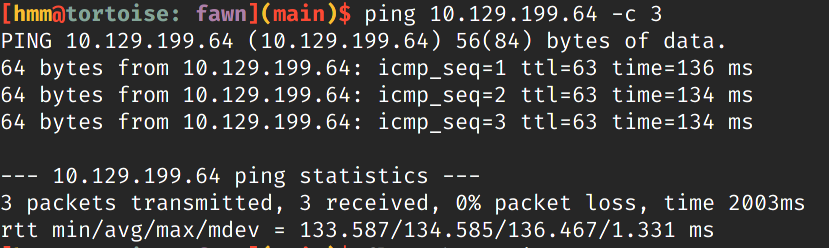
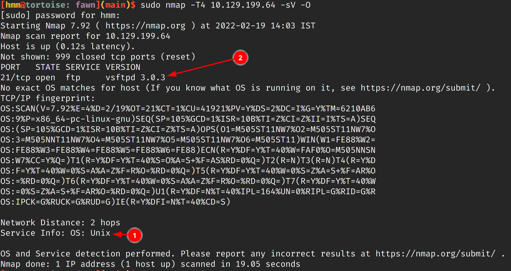
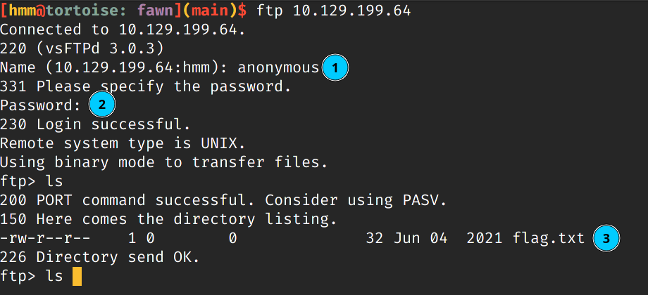

# FAWN REPORT: 

## SCANNING:

MACHINE_NAME: FAWN. 

IP_ADDRESS: 10.129.199.64

First Of all, Let us check if the machine is online or not...

Yup! The Machine is online now let us look for open ports on this
machine we will scan for open ports using **nmap**.

`sudo nmap -T4 10.129.199.64 -sV -O`

Here is what we got back from the scan: 

| PORT | STATE | SERVICE | VERSION |
|----------------------------------|
| 21/tcp| open | ftp | vsftpd 3.0.3|

OS: UNIX

## Taking Advantage of FTP Misconfiguration

Now let us try to login to target machine using FTP.

One of major flaws of using FTP is you can allow to use anonymous logins
if anonymous login is enabled in the service configuration. Let us try
to use the anonymous login credentials: 

 

**Username:** `anonymous`

**Password:** `anonymous`

Voila! We are in the system let us get our flag file and get out of
here. 

The `flag.txt` is located in target machine's home folder if you are
anywhere else in the system `cd` back to home folder and after that you
just need to run the following: `recv flag.txt`.
recv stands for receive then the filename which you want to receive
using FTP protocol. 

