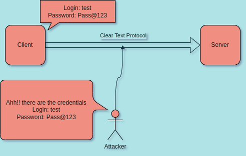
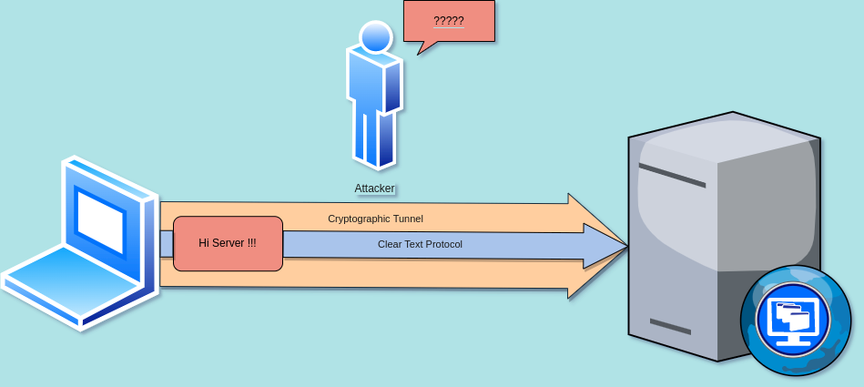
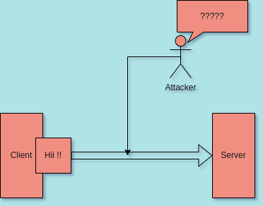
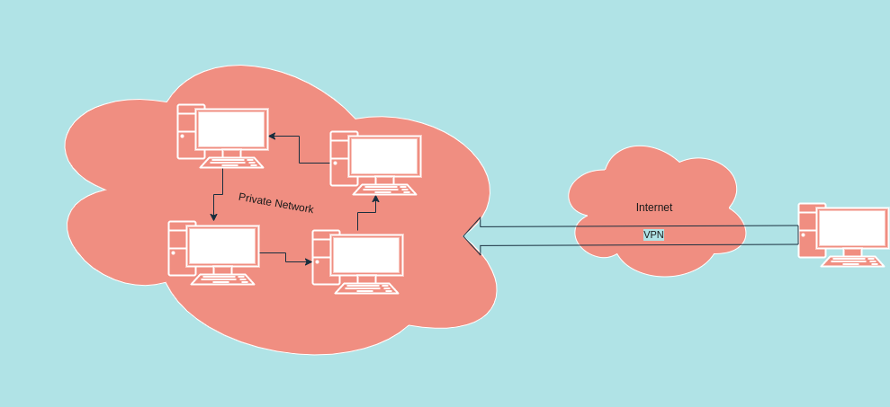

# Cryptography 

Let us first understand the difference between **clear-text protocol** and
**cryptographic protocol**.

## Clear Text Protocols: 

**Clear Text Protocols** transfer data over the network without any kind of
transformation (encryption). Let us assume an attackers eavesdrop on
your network and perform some malicious activities. Clear Text Protocol
should only be trusted network.

**What should you do if you need to run clear-text protocol on an
untrusted network?**

This is known as protocol tunneling. A great example of protocol
tunneling is **VPN** (Virtual Private Network).

## Cryptographic Protocols:

**Cryptographic Protocols** transfer data over the network with some kind of
transformation (encryption). Let us assume an attackers eavesdrop on
your network and perform some malicious activities.

## VPN (Virtual Private Network): 

A virtual private network uses cryptography to extend a private network
over a public one.

