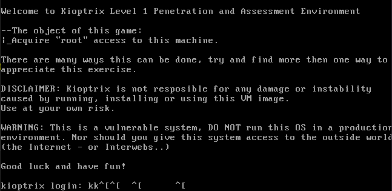
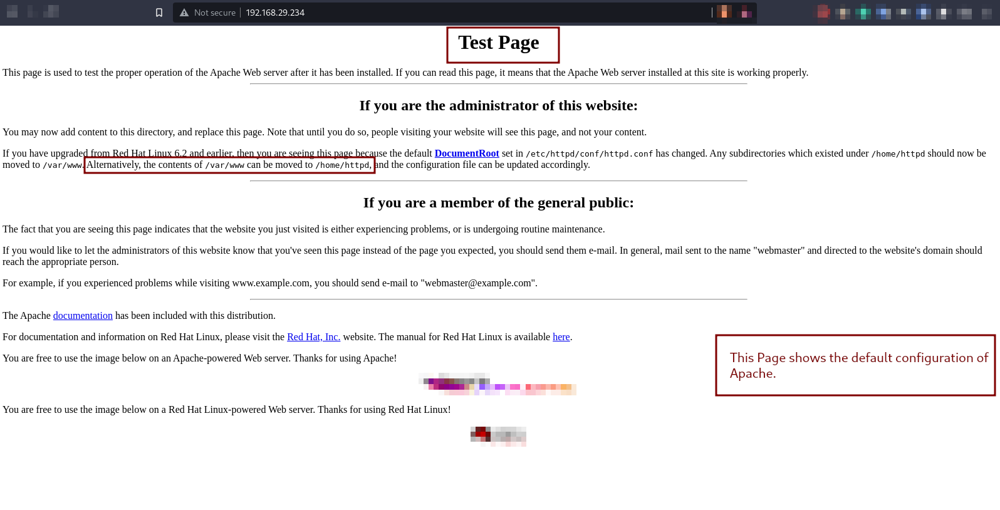

# Kioptrix - 1:

This write up, assumes you have downloaded the `Kioptrix-1` machine and
have setted up the virtual machine. If you seem to have any network
issues then make sure to set your settings as `Bridged` with `wlan0` (if
using NIC). Once you have booted up your machine you should see somethings
like this:



Let us first by finding the IP Address for the Virtual Machine:

> sudo netdiscover -r 192.168.29.0/24

Currently scanning: 192.168.34.0/16 | Screen View: Unique Hosts
| 2 Captured ARP Req/Rep packets, from 2 hosts.
| Total size: 84

| IP             | At MAC Address    | Count | Len | MAC Vendor / Hostname       |
|----------------|-------------------|-------|-----|-----------------------------|
| 192.168.29.1   | 94:fb:a7:60:e5:bf | 1     | 42  | IEEE Registration Authority |
| 192.168.29.234 | 08:00:27:ce:6b:56 | 1     | 42  | PCS Systemtechnik GmbH      |

Alright! The IP address for my virtual machine is: `192.168.29.234`. Now
let us start by collecting information about the machine using `nmap`.

> hackenv 192.168.29.234

**⚠️  Note:**

`hackenv` is my personal script which sets my hacking environment that is it
exports the given IP to `$IP` variable. You can checkout my `hackenv` command
in my script repository on GitHub.

## Reconnaisance:

> nmap -T4 192.168.29.234 -p- -A

```
Starting Nmap 7.92 ( https://nmap.org ) at 2022-08-03 17:34 IST
Nmap scan report for 192.168.29.234
Host is up (0.0061s latency).
Not shown: 65529 closed tcp ports (conn-refused)
PORT      STATE SERVICE     VERSION
22/tcp    open  ssh         OpenSSH 2.9p2 (protocol 1.99)
| _sshv1: Server supports SSHv1
| ssh-hostkey:
| 1024 b8:74:6c:db:fd:8b:e6:66:e9:2a:2b:df:5e:6f:64:86 (RSA1)
| 1024 8f:8e:5b:81:ed:21:ab:c1:80:e1:57:a3:3c:85:c4:71 (DSA)
| _  1024 ed:4e:a9:4a:06:14:ff:15:14:ce:da:3a:80:db:e2:81 (RSA)
80/tcp    open  http        Apache httpd 1.3.20 ((Unix)  (Red-Hat/Linux) mod_ssl/2.8.4 OpenSSL/0.9.6b)
|_http-server-header: Apache/1.3.20 (Unix)  (Red-Hat/Linux) mod_ssl/2.8.4 OpenSSL/0.9.6b
|_http-title: Test Page for the Apache Web Server on Red Hat Linux
| http-methods:
|_  Potentially risky methods: TRACE
111/tcp   open  rpcbind     2 (RPC #100000)
| rpcinfo:
|   program version    port/proto  service
|   100000  2            111/tcp   rpcbind
|   100000  2            111/udp   rpcbind
|   100024  1          32768/tcp   status
|_  100024  1          32768/udp   status
139/tcp   open  netbios-ssn Samba smbd (workgroup: gMYGROUP)
443/tcp   open  ssl/https   Apache/1.3.20 (Unix)  (Red-Hat/Linux) mod_ssl/2.8.4 OpenSSL/0.9.6b
| _http-server-header: Apache/1.3.20 (Unix)  (Red-Hat/Linux) mod_ssl/2.8.4 OpenSSL/0.9.6b
| ssl-cert: Subject: commonName=localhost.localdomain/organizationName=SomeOrganization/stateOrProvinceName=SomeState/countryName=--
| Not valid before: 2009-09-26T09:32:06
| _Not valid after:  2010-09-26T09:32:06
| _ssl-date: 2022-08-01T22:09:23+00:00; -1d13h55m30s from scanner time.
| sslv2:
| SSLv2 supported
| ciphers:
| SSL2_DES_64_CBC_WITH_MD5
| SSL2_DES_192_EDE3_CBC_WITH_MD5
| SSL2_RC2_128_CBC_WITH_MD5
| SSL2_RC4_128_EXPORT40_WITH_MD5
| SSL2_RC2_128_CBC_EXPORT40_WITH_MD5
| SSL2_RC4_64_WITH_MD5
| _    SSL2_RC4_128_WITH_MD5
| _http-title: 400 Bad Request
32768/tcp open  status      1 (RPC #100024)

Host script results:
|_clock-skew: -1d13h55m30s
|_smb2-time: Protocol negotiation failed (SMB2)
|_nbstat: NetBIOS name: KIOPTRIX, NetBIOS user: <unknown>, NetBIOS MAC: <unknown> (unknown)

Service detection performed. Please report any incorrect results at https://nmap.org/submit/ .
Nmap done: 1 IP address (1 host up) scanned in 30.23 seconds
```

**Ports:**

This are all the ports which are open of Kioptrix machine.

| Port Number | Service Name | Version Name          | Vulnerabilities (if any) |
|-------------|--------------|-----------------------|--------------------------|
| 22/tcp      | ssh          | OpenSSH 2.9p2         |             -            |
| 80/tcp      | http         | Httpd 1.3.20          |             -            |
| 111/tcp     | rpcbind      | -                     |             -            |
| 139/tcp     | netbios-ssn  | Workgroup: gMYGROUP   |             -            |
| 443/tcp     | ssl/https    | Apache 1.3.20 (Linux) |             -            |
| 32768/tcp   | rpc          | -                     |             -            |

Let us start checkout each and every port for Vulnerabilities.

* PORT 22 (SSH):


* PORT 80 (HTTP):



